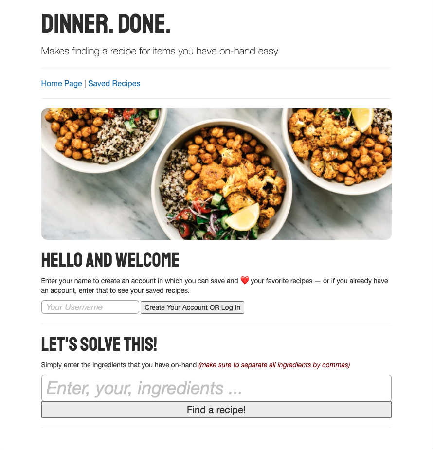
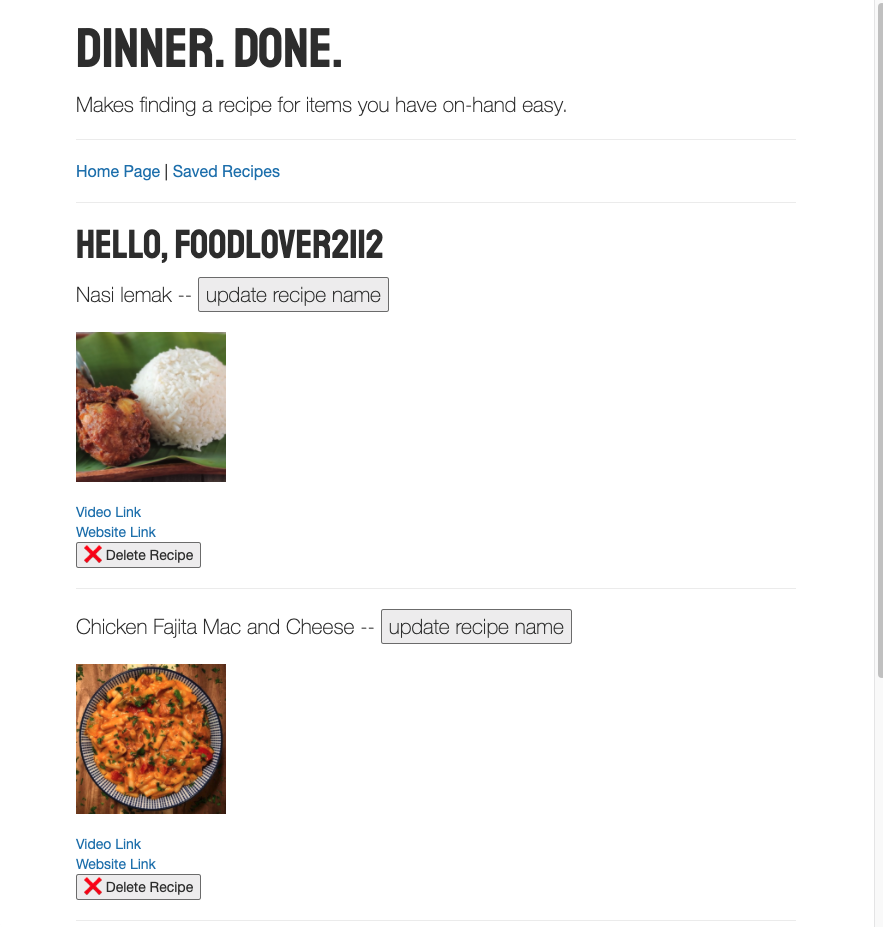

# Dinner. Done.

## General Assembly SEI 503 - Project 2

This application employs the following technologies: 
<ul>
<li>Express</li> 
<li>Node.js</li> 
<li>NPM</li> 
<li>PostgreSQL</li> 
<li>Sequelize</li> 
<li>Axios</li> 
<li>HTML</li> 
<li>JavaScript</li> 
<li>CSS</li> 
<li>EJS</li> 
<li>Utilizes RESTful API</li> 
<li>CRUD</li> 
<li>Bootstrap</li> 
</ul>

Dinner. Done. is an app that fulfills the lifelong question of, "What can I possibly make out of <i>this</i>"? 
  
By simply entering your random-kitchen-found-items, you can peruse thousands of recipes, of all cuisine types, that match your ingredients. 
  
By creating an account (or user session) you can save, delete or even rename your recipes. Also provided are links to recipe specific videos, as well as full recipes. Happy hunting!

